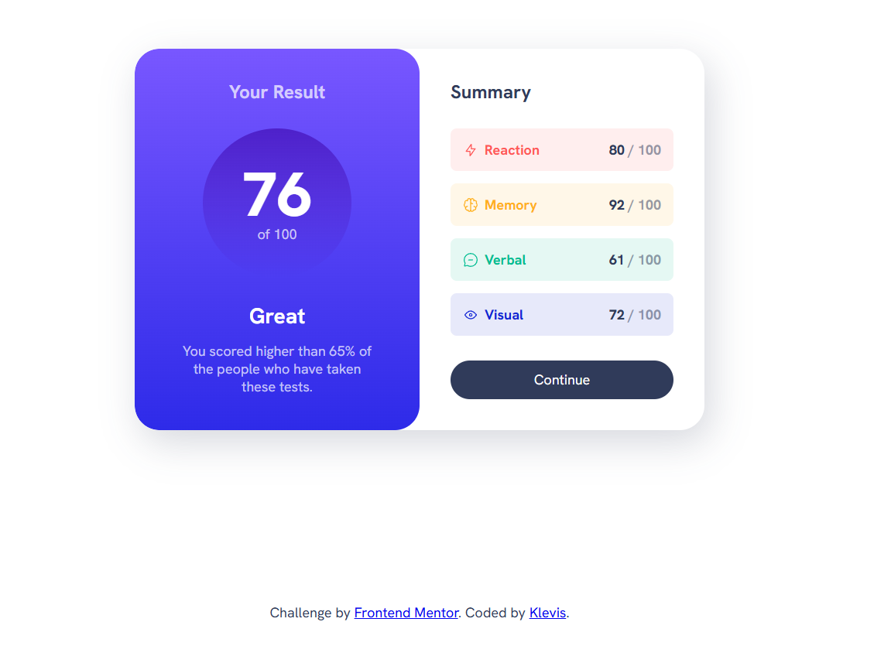

📊 Results Summary Component

A responsive Results Summary Component built as part of a Frontend Mentor challenge.
The project focuses on building a clean UI component that displays a user’s score and a breakdown of performance categories.

🚀 Features

- Score summary card
- Category breakdown (Reaction, Memory, Verbal, Visual)
- Gradient score section
- Clean card layout
- Hover states for the button
- Responsive layout

| Technology       | Purpose                 |
| ---------------- | ----------------------- |
| **HTML5**        | Semantic page structure |
| **CSS3**         | Styling and layout      |
| **Flexbox**      | Layout alignment        |
| **GitHub Pages** | Deployment              |

📸 Screenshot

